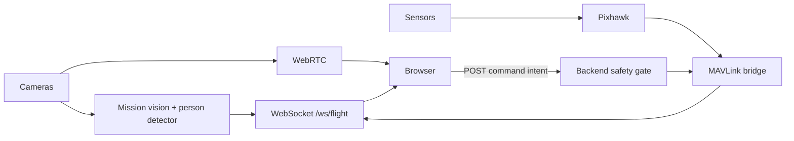

# KRTI 2026 VTOL Mission Dashboard Design

**Status:** Disetujui secara konseptual pada 2026-08-10; menunggu review spesifikasi tertulis
**Target:** Laptop ground station Divisi VTOL KRTI 2026
**Airframe:** VTOL elektrik dengan Pixhawk/ArduPilot
**Frontend:** TanStack Start + IBM Carbon `g100`
**Video:** WebRTC kamera depan dan/atau bawah
**Kontrol:** Mission controls terbatas; RC tetap jalur kendali utama

## 1. Acuan dan Tujuan

Desain mengacu pada bagian 3.3 Divisi Vertical Take Off & Landing (VTOL), halaman PDF 32-44 dari `Panduan-KRTI-2026l.pdf`. Implementasi GPS map mengikuti pola project `D:/KKI2/KKI2026/dashboard`.

Dashboard membantu operator menjalankan misi VTOL sekuensial:

1. navigasi manual dan transisi di WP1;
2. pengiriman paket medis otonom di WP2;
3. navigasi Triple Gate;
4. pelacakan garis hitam berbasis visi;
5. Single Gate dan pendaratan otonom.

Operator harus dapat memahami mode terbang, fase misi, kesehatan link, keselamatan, posisi, status payload, dan target visi dalam dua detik. Dashboard bukan pengganti RC, Mission Planner, tombol Emergency Stop fisik, atau safety logic pada flight controller/backend.

## 2. Keputusan Produk

- Dashboard berorientasi kompetisi VTOL, bukan multirotor umum.
- Deteksi manusia dipertahankan sebagai peringatan keselamatan pasif.
- Target visi misi adalah ArUco, gate, drop zone/Box Merah, garis hitam putus-putus, dan landing pad.
- GPS satellite map dipertahankan untuk awareness dan rekam lintasan, tetapi GPS tidak menjadi syarat ARM/AUTO karena arena dapat GPS-denied.
- Payload dilepas otomatis oleh backend ketika target WP2 tervalidasi. Dashboard tidak menyediakan tombol drop utama.
- ELS dipicu oleh flight controller/backend jika lost contact melewati 15 detik. Dashboard hanya menampilkan countdown dan statusnya.

## 3. Batas Scope

### Termasuk pada revisi frontend

- kontrak event VTOL dan mock adapter;
- status rail VTOL dan telemetry posisi lengkap;
- GPS satellite map dengan overlay rute/arena/lintasan;
- overlay target visi dan person warning;
- fase misi, skor, retry checkpoint, dan status payload;
- command rail VTOL;
- failure state link, kamera, GPS/map, sensor, command, person warning, dan ELS;
- unit/component checks dan smoke check melalui Chrome DevTools.

### Tidak termasuk

- implementasi WebRTC, inference, MAVLink bridge, atau ELS nyata;
- joystick virtual atau kontrol attitude;
- editor waypoint/Mission Planner lengkap;
- autonomous avoidance dari hasil person detection;
- scoring vision otomatis tanpa event backend;
- offline satellite tile server;
- penyimpanan cloud, akun, multi-tenant, atau analytics historis.

## 4. Aturan Kompetisi yang Direpresentasikan

- Setup berlangsung 5 menit.
- Misi berlangsung 10 menit dan timer terus berjalan saat retry.
- Misi 1 dimulai dalam mode Manual.
- Transisi ke Autonomous dilakukan di WP1.
- Paket First Aid Kit OneMed memiliki berat minimal 100 gram.
- Retry kembali ke Start, WP1, WP2, atau WP4 sesuai misi yang gagal.
- Skor maksimum per misi adalah 10, 40, 20, 15, dan 15.
- Wahana memerlukan kamera depan dan/atau bawah, altimeter/rangefinder, collision avoidance, ELS, dan navigation lights merah/hijau.
- Emergency Stop fisik harus terlihat jelas pada wahana.

Panduan memiliki konflik penamaan waypoint: narasi menyebut Misi 3 `WP2→WP4` dan Misi 4 `WP4→WP5`, sedangkan tabel penilaian menyebut Misi 3 mencapai WP3 dan Misi 4 `WP3→WP4`. Dashboard menggunakan nama aksi misi sebagai label utama dan menerima waypoint label dari backend agar tidak mengunci salah satu interpretasi sebelum klarifikasi panitia.

## 5. Visual Direction

Dashboard memakai bahasa visual cockpit utilitarian dan padat.

- Carbon `g100` menjadi satu-satunya theme.
- IBM Plex Sans untuk UI dan IBM Plex Mono untuk telemetry, koordinat, timer, dan confidence.
- Cyan untuk interaksi, hijau untuk normal/locked, amber untuk warning, merah untuk critical/person safety, dan biru untuk informasi.
- Status selalu memiliki label/icon; warna bukan satu-satunya pembeda.
- Flat surfaces dan divider; tanpa glass, gradient, glow, shadow dekoratif, pill, emoji, atau motion dekoratif.
- Target minimum 1366×768; optimal 1920×1080.

## 6. Tata Letak

```text
┌──────────────────────────────────────────────────────────────────────────────┐
│ KRTI VTOL | LINK | MANUAL/AUTO/ELS | ARMED | ALT/RANGE | BATT | T-09:42   │
├───────────────────────────────────────────────────┬──────────────────────────┤
│                                                   │ GPS MAP + ARENA OVERLAY  │
│ LIVE CAMERA FRONT/DOWN                            ├──────────────────────────┤
│ person | ArUco | gate | red box | line | landing │ MISSION 1..5 + SCORE     │
│ synchronized bbox/pose + FPS/latency              ├──────────────────────────┤
│                                                   │ POSITION + PAYLOAD       │
│                                                   │ LAT/LON | X/Y | HDG      │
│                                                   ├──────────────────────────┤
│                                                   │ SAFETY EVENTS            │
├───────────────────────────────────────────────────┴──────────────────────────┤
│ [HOLD ARM] [ENABLE AUTO] [PAUSE/HOLD] [RETRY]       [EMERGENCY LAND]       │
└──────────────────────────────────────────────────────────────────────────────┘
```

Video tetap menjadi area terbesar. Sidebar menampilkan GPS map, progres/skor, posisi, payload, dan safety events. Critical alert tampil di atas viewport tanpa menutupi target utama. Command rail selalu terlihat.

## 7. Komponen

```text
MissionOperationsPage
├── StatusRail
├── CriticalAlert
├── VideoViewport
│   └── VisionOverlay
├── MissionSidebar
│   ├── NavigationMap
│   ├── MissionProgress
│   ├── PositionTelemetry
│   ├── PayloadStatus
│   └── SafetyEventQueue
└── CommandRail
```

- `StatusRail` menampilkan status yang harus terbaca terus-menerus.
- `VisionOverlay` merender target berdasarkan frame dan kamera yang sama.
- `NavigationMap` menampilkan satellite base map, arena, rute, track, waypoint/gate, dan heading wahana.
- `MissionProgress` menampilkan lima fase, skor terkonfirmasi, timer, dan retry checkpoint.
- `PositionTelemetry` menampilkan posisi global dan lokal.
- `SafetyEventQueue` memuat person warning dan kegagalan sensor/link; acknowledgment hanya mengubah status UI.
- `CommandRail` mengirim intent dan menunggu acknowledgment backend.

## 8. GPS Map

Map mengikuti arsitektur dashboard KKI:

1. Google Maps satellite iframe dibangun dengan `ll=<lat,lon>`, zoom 22, `t=k`, dan `output=embed`.
2. Query `q` tidak dipakai agar Google tidak menambahkan pin merah.
3. SVG `viewBox="0 0 100 100"` diletakkan di atas base map.
4. SVG memuat route polyline, travelled track, Start/WP/gate/drop zone/landing pad, arah utara, dan marker VTOL sesuai heading.
5. Posisi live memakai GPS terbaru; bila posisi belum ada, map memakai site center yang dikonfigurasi.
6. Tombol refresh memusatkan ulang map ke posisi live terbaru.
7. Latitude dan longitude ditampilkan enam angka desimal beserta hemisfer.

Konversi arena lokal dan GPS memakai pola `mission-site.ts`:

```ts
type MissionSite = {
  name: string
  center: { latitude: number; longitude: number }
  courseReference: { x: number; y: number }
  metersPerUnit: { x: number; y: number }
  courseUpBearingDeg: number
}
```

Transformasi memakai radius bumi 6.371.008,8 meter untuk mengubah local East/North menjadi latitude/longitude dan sebaliknya. Overlay visual dikalibrasi dengan `courseAnchor`, `mapAnchor`, `scaleX`, `scaleY`, dan `rotationDeg`, lalu dapat di-nudge saat kalibrasi lapangan.

Jika imagery Google tidak tersedia, SVG arena, rute, track, marker, dan telemetry tetap ditampilkan di atas latar grid netral. Kegagalan base map tidak mengunci command.

## 9. Kontrak Data

Semua event memiliki `type`, `seq`, dan `timestampMs`.

```ts
type FlightMode = "MANUAL" | "AUTO" | "HOLD" | "ELS"
type CameraId = "front" | "down"
type VisionClass =
  | "person"
  | "aruco"
  | "gate"
  | "drop_zone"
  | "line"
  | "landing_pad"

type TelemetryEvent = {
  type: "telemetry"
  seq: number
  timestampMs: number
  armed: boolean
  mode: FlightMode
  batteryPercent: number
  voltage: number
  latitude: number | null
  longitude: number | null
  gpsFix: number
  gpsSatellites: number
  hdop: number | null
  localXM: number | null
  localYM: number | null
  altitudeM: number
  rangefinderM: number | null
  groundSpeedMps: number
  headingDeg: number
  rollDeg: number
  pitchDeg: number
  yawDeg: number
  collisionClearanceM: number | null
}

type VisionEvent = {
  type: "vision"
  seq: number
  timestampMs: number
  id: string
  frameId: number
  camera: CameraId
  className: VisionClass
  confidence: number
  box?: { x: number; y: number; width: number; height: number }
  path?: Array<{ x: number; y: number }>
  markerId?: number
}

type MissionEvent = {
  type: "mission"
  seq: number
  timestampMs: number
  phase: 1 | 2 | 3 | 4 | 5
  phaseName: string
  waypointLabel: string
  status: "ready" | "active" | "passed" | "failed" | "retry"
  elapsedSeconds: number
  score: number
  retryCheckpoint: "START" | "WP1" | "WP2" | "WP4"
}

type PayloadEvent = {
  type: "payload"
  seq: number
  timestampMs: number
  state: "secured" | "armed" | "released" | "unknown"
}

type SafetyEvent = {
  type: "safety"
  seq: number
  timestampMs: number
  linkLostSeconds: number
  elsState: "standby" | "countdown" | "active"
  personWarning: boolean
  obstacleWarning: boolean
}
```

Koordinat `box` dan `path` dinormalisasi ke `0..1`; setiap vision event harus membawa sedikitnya satu bentuk geometry. Latitude/longitude dan local X/Y bernilai `null` saat sumber posisinya tidak tersedia. Navigasi GPS-denied memakai local X/Y dari backend, bukan nilai GPS sintetis.

## 10. Data Flow



TanStack Query menangani snapshot/status misi dan command mutation. Satu native WebSocket membawa telemetry, vision, mission, payload, safety, link health, dan acknowledgment. React reducer hanya menangani state UI/realtime lokal.

## 11. Command dan Safety Boundary

Command frontend:

- `arm`;
- `enable_autonomy`;
- `pause_mission`;
- `retry`;
- `emergency_land`.

Tidak ada `takeoff`, joystick manual, RTL, atau tombol drop utama. Lepas landas Misi 1 dilakukan melalui RC dalam mode Manual. Payload release dan ELS dijalankan otomatis oleh backend/flight controller.

Aturan:

- ARM memakai hold-to-confirm 1,5 detik.
- Enable autonomy hanya tersedia setelah backend menyatakan transisi WP1 siap.
- Retry menampilkan checkpoint tujuan sebelum dikirim.
- Emergency land selalu paling menonjol; bila link terputus, UI menyatakan command tidak dapat dikirim dan meminta operator memakai RC/Emergency Stop fisik.
- Command dianggap berhasil hanya setelah acknowledgment backend.
- Timeout tidak pernah dianggap sukses dan command penerbangan tidak auto-retry.
- Backend adalah satu-satunya pihak yang boleh berbicara MAVLink.

## 12. Failure Handling

| Kondisi | Perilaku dashboard |
|---|---|
| WebRTC terputus | Bekukan frame terakhir, tampilkan `CAMERA LOST`, reconnect dengan backoff |
| Telemetry stale | Tandai `STALE`, kunci command biasa, tampilkan waktu sejak event terakhir |
| Lost contact 0-15 detik | Tampilkan countdown menuju ELS |
| Lost contact >15 detik | Tampilkan `ELS ACTIVE`; jangan mengklaim pemicu berasal dari browser |
| Person terdeteksi | Overlay merah + alert prioritas tinggi; tanpa command otomatis |
| Collision clearance rendah | Alert merah berdasarkan event backend |
| Rangefinder/position tidak tersedia | Tampilkan `NO DATA`; jangan mengganti dengan nol |
| GPS tidak tersedia | Lat/lon `NO FIX`; local X/Y dan mission vision tetap aktif |
| Base map gagal dimuat | Tampilkan grid + SVG overlay; command tetap tersedia sesuai safety state lain |
| Kamera/metadata beda frame | Buang metadata terlambat; jangan menempel ke frame terbaru |
| Command ditolak | Tampilkan alasan backend |
| Command timeout | Status `UNKNOWN`; minta operator cek RC/Pixhawk |
| Vision burst | Batasi event UI; person warning aktif tidak hilang tanpa acknowledgment |

## 13. Mock Scenarios

Mock adapter harus mendukung:

1. penerbangan Manual normal;
2. transisi WP1 ke Autonomous;
3. deteksi person sebagai safety warning;
4. deteksi ArUco/gate/drop zone/line/landing pad;
5. payload secured, armed, dan released;
6. retry untuk tiap checkpoint;
7. low battery;
8. GPS no-fix dengan local position tetap berjalan;
9. base map unavailable;
10. camera disconnect/reconnect;
11. telemetry stale dan ELS countdown/active;
12. collision warning;
13. command accepted/rejected/timeout.

## 14. Target Performa

- WebRTC 720p minimum, 15-30 FPS.
- Glass-to-glass latency target kurang dari 300 ms di LAN.
- Telemetry 5-10 Hz.
- Link health diperbarui setiap satu detik.
- Overlay hanya menempel ke frame/camera yang sesuai.
- Track GPS dibatasi agar render tetap konstan.
- UI tetap responsif saat reconnect atau vision burst.
- Layout tidak overflow pada 1366×768.

## 15. Acceptance

- Status rail menampilkan mode VTOL, link, armed, altitude/range, baterai, dan timer.
- Position telemetry menampilkan latitude, longitude, GPS fix/satellites/HDOP, local X/Y, altitude/rangefinder, heading, ground speed, roll, pitch, dan yaw.
- GPS map mengikuti pola KKI: satellite iframe, SVG route/track overlay, heading marker, coordinate readout, dan refresh.
- GPS no-fix atau base map failure tidak mengunci ARM/AUTO hanya karena jumlah satelit.
- Lima misi dan skor 10/40/20/15/15 terlihat.
- Retry menampilkan checkpoint tujuan sesuai fase.
- Person detection memunculkan warning tanpa mengirim command.
- Overlay mendukung seluruh kelas visi yang disepakati.
- Tidak ada RTL, takeoff browser, atau manual payload drop utama.
- Lost contact menampilkan countdown dan `ELS ACTIVE` setelah 15 detik.
- Command tidak menampilkan sukses sebelum acknowledgment.
- Status `NO DATA` tidak direpresentasikan sebagai angka nol palsu.
- Semua status memiliki label/icon dan tidak bergantung pada warna.
- Layout lulus inspeksi 1366×768 dan 1920×1080 melalui Chrome DevTools.
- Unit/component checks mencakup map projection, Manual→Auto, retry, payload, GPS no-fix, person warning, dan ELS.

## 16. Urutan Implementasi

1. Migrasikan kontrak domain dan reducer ke event VTOL.
2. Port pola `mission-site` dan `site-map-projection` dari dashboard KKI untuk site VTOL.
3. Perbarui mock adapter dan checks kontraknya.
4. Ubah status rail, viewport/overlay, dan critical alerts.
5. Ganti sidebar dengan GPS map, mission progress, position, payload, dan safety events.
6. Ganti command rail dan safety gating.
7. Integrasikan route dan seluruh mock scenario.
8. Jalankan unit/component checks, typecheck, build, dan smoke check Chrome DevTools.

## 17. Definition of Done

Frontend TanStack Start berjalan dengan Carbon `g100`, seluruh mock scenario VTOL dapat dipilih tanpa backend, GPS map mengikuti pola project KKI, kontrak event tidak lagi mengasumsikan person-only atau GPS-dependent mission, dan acceptance frontend terbukti melalui checks serta inspeksi browser. Integrasi kamera/inference dan MAVLink/Pixhawk tetap memperoleh rencana terpisah.